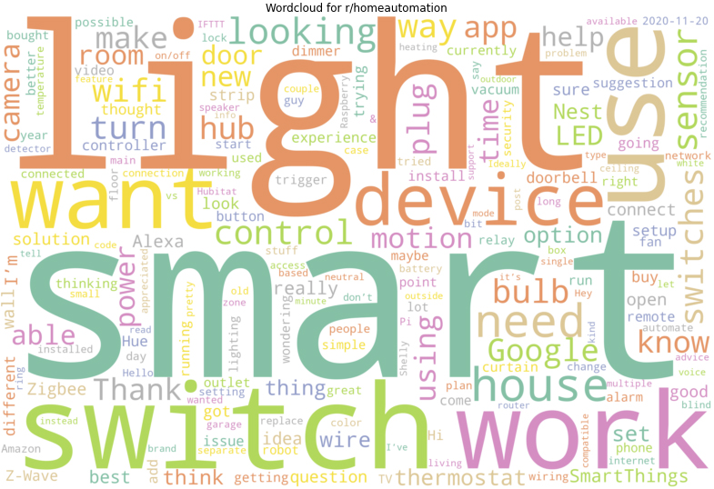

# SubReddit Web Scraping, Analysis & Classification: r/homeassistant vs r/homeautomation

## Problem Statement

Homeowners are on the constant search for effective ways to upkeep and enhance their living spaces. In search of ideas, solutions, or simply advice to fix a broken thermostat, people around the world have turned to home-centric communities on Reddit for advice and discussion.

Taking the role of a business analyst in a company specializing in home appliances (light fixtures, vacuum cleaners, etc), I am tasked to perform research on smart devices as we explore the option of expanding and enhancing our current line of products. We have acquired a very large market-research dataset from varied sources to aid the exploration effort, unfortunately part of the metadata on data origin was lost. All that we know is the data segment that was collected from Reddit originated from r/homeassistant and r/homeautomation. Owing to time and data-storage constraints, we only have time to narrow down on posts that originate from one subreddit that is more relevant to our needs, which is to explore the current trends and issues of popular, easy to install, smart-home devices. Data from the less relevant subreddit is expected to be disposed so as to alleviate the data-storage issue.

<b>The goal would be to build a text classifier based on a small subset of subreddit data scraped from the Web, that can differentiate between posts from r/homeassistant and those from r/homeautomation, so that we can reliably classify and preserve the relevant text data from our market-research dataset.</b>

## Executive Summary

This project is focused on building a text classifier to differentiate between posts from r/homeassistant and r/homeautomation.

*Data Collection* phase began with scraping of the Reddit JSON API and it yielded 501 posts from each subreddit. 

*Data Cleaning* phase revealed some r/homeassistant posts containing programmatic code, which could impact text analysis efforts. Both subreddits had a proportion of their posts containing only titles, as users did not see any further need to elaborate on their posts within the main body.

In the *Data Analysis* phase, distributions for word counts of titles and posts where charted out, but both subreddits did not show any significant differences in terms of content length. During wordcloud and top 20 frequently-used words analysis, it indicated that users in r/homeassistant were centered around tinkering with code and individual components (e.g. single-board computers, wireless modules, sensors, etc) to create new or enhance existing devices. On the otherhand, r/homeautmation posts tended towards smart-home devices that are well known consumer brands on the market, without having to go to the level of crafting a smart-home device together from separate parts. All in all, r/homeassistant seem to be attracting hobby electronic enthusiasts, while r/homeautomation is a more suitable place for typical consumers of tech gadgets.

In *Pre-processing, Model Creation & Benchmarking* phase, Term Frequency-Inverse Document Frequency vectorizer was used to tranform our text data into vectors. r/homeautomation was set as the positive class as it fulfilled the business requirement of our company wanting to explore issues faced by owners/prospective buyers of smart-home devices. Scoring metrics were determined to be test-set accuracy score and recall score.

Multinomial Naive Bayes classifier and Support Vector classifier were modeled, fitted and scored, eventually showing that the Multinomial Naive Bayes classifier performed slightly better in terms of test-set accuracy score. Subsequent efforts to tune the Multinomial Naive Bayes classifier and Support Vector Classifier did not yield significantly better results, especially in terms of test-set accuracy score and recall score.

In favor of the simpler model that was faster to train at the same time, we selected the Multinomial Naive Bayes classifier (alpha=1.0) as our choice model for classification of incoming content from the 2 subreddits, with the aim of identifying r/homeautomation posts to further our business objectives. It has a test-set Accuracy Score of 81.6% and Recall Score of 0.824.

## Model Performance Table
| Model Name                                      | Parameters                         | Train-set Accuracy Score (%) | Test-set Accuracy Score (%) | Recall Score |
|-------------------------------------------------|------------------------------------|------------------------------|-----------------------------|--------------|
| Baseline                                        | N.A.                               | 50.1                         | 50.1                        | N.A.          |
| MultinomialNB (default)                         | alpha=1.0                          | 94.3                         | 81.6                        | 0.824        |
| Support Vector Clasifier (default)              | C=1.0, kernel=rbf, gamma=scale     | 98.4                         | 81.6                        | 0.808        |
| MultinomialNB (GridSearchCV tuned)              | alpha=0.5                          | 95.2                         | 81.2                        | 0.816        |
| Support Vector Classifier (GridSearch CV tuned) | C=0.5, kernel=sigmoid, gamma=scale | 91.9                         | 81.6                        | 0.824        |

## Data Dictionary
Based on `subreddits_cleaned.csv` dataset for pre-processing and model benchmarking.

| Column                   | Type     | Description                                                                                            |
|--------------------------|----------|--------------------------------------------------------------------------------------------------------|
| title                    | string   | Original title of subreddit post                                                                       |
| selftext                 | string   | Original main post content                                                                             |
| target                   | string   | Subreddit name (r/homeassistant or r/homeautomation)                                                   |
| created_datetime         | datetime | Time of subreddit post creation                                                                        |
| title_cleaned            | string   | `title` value that has been cleaned, i.e. emoji, URL, HTML encodings and newline characters removed    |
| post_cleaned             | string   | `selftext` value that has been cleaned, i.e. emoji, URL, HTML encodings and newline characters removed |
| post_word_count          | int      | Number of words in `post_cleaned`                                                                      |
| title_word_count         | int      | Number of words in `title_cleaned`                                                                     |
| full_text                | string   | Concatenated value of `title_cleaned` and `post_cleaned`                                               |
| full_text_no_punctuation | string   | `full-text` value with leading and trailing punctuations of every word removed                         |

